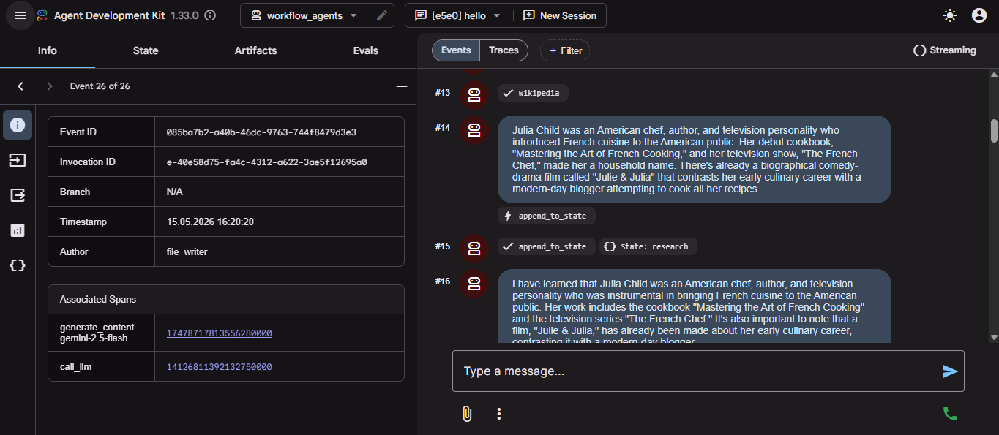
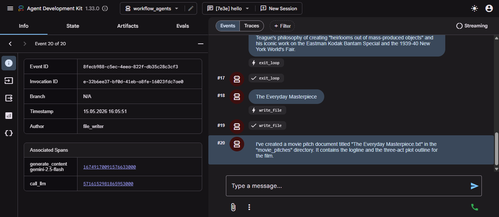

# Google ADK Workflow Agents Lab

A multi-agent workflow system built with Google ADK using SequentialAgent, LoopAgent, and ParallelAgent to generate movie pitch documents collaboratively.

## 📸 Workflow Demo

<p align="center">
  
</p>

## 📸 Final Output Generation

<p align="center">
  
</p>

## 🚀 Project Overview

This project demonstrates how to build advanced multi-agent systems using Google Agent Development Kit (ADK).

The workflow includes:
- SequentialAgent workflows
- LoopAgent iterative refinement
- ParallelAgent fan-out/fan-in processing
- Wikipedia research tools
- File writing agents
- State management between agents

## 🧠 Agents Included

### Workflow Agents
- Researcher Agent
- Screenwriter Agent
- Critic Agent
- File Writer Agent
- Box Office Researcher Agent

## 🧠 Workflow Architecture
```bash
Researcher → Screenwriter → Critic Loop  
↓  
Preproduction Team (Parallel Analysis)  
↓  
File Writer
```
## ⚙️ Technologies Used

- Python
- Google ADK
- Gemini 2.5 Flash
- LangChain
- WikipediaQueryRun
- Google Cloud Shell

## 📂 Project Structure

```bash
workflow_agents/
parent_and_subagents/
movie_pitches/
```
## 🚀 Features

- SequentialAgent workflow orchestration
- LoopAgent for iterative refinement
- ParallelAgent for parallel analysis
- Wikipedia research integration
- Automated movie pitch generation
- File writing and state management
- Multi-agent collaboration with Google ADK

## ☁️ Built With
Google Cloud
Google Agent Development Kit (ADK)
Gemini Models

## 📌 Learning Outcomes

Through this lab, I learned:

Multi-agent orchestration
Workflow-based agent systems
Iterative agent loops
Parallel task execution
Agent state management
Tool-based AI agents

### 👩‍💻 Author

Beyza UZUN
